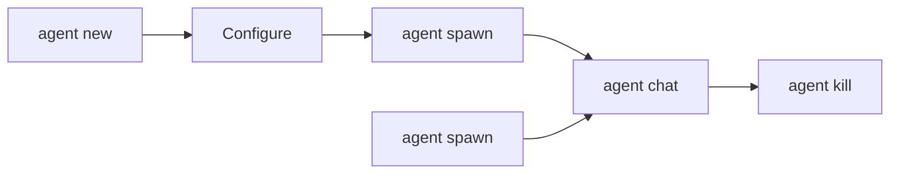

Agent commands let you create, list, spawn, chat with, and terminate agents in your AgentOS deployment.

## agent new

Create a new agent from a template.

```bash
agentos agent new [template]
```

<ParamField path="template" type="string">
  Template name to use (defaults to "assistant")
</ParamField>

### Available Templates

AgentOS includes 45+ pre-built agent templates:

<Tabs>
  <Tab title="Development">
    - `coder` - Full-stack coding agent
    - `debugger` - Debug and fix issues
    - `architect` - System design and architecture
    - `code-reviewer` - Code review and analysis
    - `doc-writer` - Documentation generation
    - `test-engineer` - Test creation and execution
    - `devops-lead` - DevOps and infrastructure
    - `ai-engineer` - AI/ML development
  </Tab>
  <Tab title="Research & Analysis">
    - `researcher` - Research and information gathering
    - `analyst` - Data analysis
    - `data-scientist` - Data science and ML
    - `trend-researcher` - Trend analysis
    - `evidence-collector` - Evidence gathering
    - `reality-checker` - Fact checking
  </Tab>
  <Tab title="Business">
    - `orchestrator` - Multi-agent coordination
    - `planner` - Project planning
    - `customer-support` - Customer service
    - `sales-assistant` - Sales support
    - `recruiter` - Recruiting and HR
    - `legal-assistant` - Legal document review
    - `personal-finance` - Financial planning
  </Tab>
  <Tab title="Creative">
    - `writer` - Content writing
    - `content-creator` - Content creation
    - `brand-guardian` - Brand consistency
    - `image-prompt-engineer` - Image prompt generation
    - `ux-architect` - UX design
  </Tab>
  <Tab title="Productivity">
    - `assistant` - General assistant
    - `email-assistant` - Email management
    - `meeting-assistant` - Meeting notes and summaries
    - `translator` - Language translation
    - `tutor` - Educational tutoring
    - `travel-planner` - Travel planning
  </Tab>
  <Tab title="Specialized">
    - `security-auditor` - Security auditing
    - `health-tracker` - Health tracking
    - `home-automation` - Smart home control
    - `social-media` - Social media management
    - `growth-hacker` - Growth strategies
    - `app-store-optimizer` - App store optimization
  </Tab>
</Tabs>

**Example:**
```bash
agentos agent new coder
```

**Output:**
```
✓ Created agent: agent-coder-1
```

## agent list

List all active agents.

```bash
agentos agent list
```

**Example output:**
```
ID                   STATUS          NAME
default              active          Default Assistant
agent-coder-1        active          Code Agent
agent-researcher-2   active          Research Agent
```

## agent chat

Start an interactive chat session with a specific agent.

```bash
agentos agent chat <agent>
```

<ParamField path="agent" type="string" required>
  Agent ID to chat with
</ParamField>

**Example:**
```bash
agentos agent chat agent-coder-1
```

**Interactive session:**
```
→ Chatting with agent-coder-1. Type 'exit' to quit.

you> Write a function to validate email addresses

agent> I'll create an email validation function for you:

```javascript
function validateEmail(email) {
  const pattern = /^[^\s@]+@[^\s@]+\.[^\s@]+$/;
  return pattern.test(email);
}
```

This function uses a regex pattern to validate basic email format.

you> exit
```

<Tip>
  Use `agentos chat [agent]` as a shorthand for quick chat sessions.
</Tip>

## agent kill

Terminate a running agent.

```bash
agentos agent kill <agent>
```

<ParamField path="agent" type="string" required>
  Agent ID to terminate
</ParamField>

**Example:**
```bash
agentos agent kill agent-coder-1
```

**Output:**
```
✓ Agent agent-coder-1 terminated
```

<Warning>
  Killing an agent terminates it immediately. Any ongoing operations will be stopped.
</Warning>

## agent spawn

Spawn a new agent instance from a template.

```bash
agentos agent spawn <template>
```

<ParamField path="template" type="string" required>
  Template name to spawn from
</ParamField>

**Difference between `new` and `spawn`:**
- `agent new` - Create a new agent definition (can be customized before running)
- `agent spawn` - Instantly create and start a new agent instance

**Example:**
```bash
agentos agent spawn researcher
```

**Output:**
```
✓ Spawned: agent-researcher-3
```

## Quick Chat & Message

Two additional commands for interacting with agents:

### chat

Shorthand for `agent chat`.

```bash
agentos chat [agent]
```

<ParamField path="agent" type="string">
  Agent ID (defaults to "default")
</ParamField>

**Example:**
```bash
# Chat with default agent
agentos chat

# Chat with specific agent
agentos chat coder
```

### message

Send a single message without starting an interactive session.

```bash
agentos message <agent> <text> [--json]
```

<ParamField path="agent" type="string" required>
  Agent ID to message
</ParamField>

<ParamField path="text" type="string" required>
  Message text
</ParamField>

<ParamField path="--json" type="boolean">
  Return response in JSON format
</ParamField>

**Example:**
```bash
agentos message coder "Explain the factory pattern"
```

**Output:**
```
The factory pattern is a creational design pattern that provides
an interface for creating objects without specifying their exact class...
```

**JSON output:**
```bash
agentos message coder "Explain the factory pattern" --json
```

```json
{
  "agentId": "coder",
  "content": "The factory pattern is a creational design pattern...",
  "tokens": 245,
  "model": "claude-opus-4-6",
  "timestamp": "2026-03-09T10:30:00Z"
}
```

## Agent Lifecycle

Typical agent workflow:



## Examples

<CodeGroup>
```bash Quick Start
# Create and chat with a coder agent
agentos agent new coder
agentos agent chat agent-coder-1
```

```bash One-off Message
# Send a single message
agentos message researcher "What's new in AI this week?"
```

```bash Multiple Agents
# Spawn multiple specialized agents
agentos agent spawn coder
agentos agent spawn researcher
agentos agent spawn reviewer

# List all agents
agentos agent list
```

```bash Cleanup
# Kill inactive agents
agentos agent kill agent-coder-1
agentos agent kill agent-researcher-2
```
</CodeGroup>

## Integration with Workflows

Agents can be invoked from workflows:

```json
{
  "steps": [
    {
      "type": "agent",
      "agentId": "researcher",
      "input": "Research topic: ${input.topic}"
    },
    {
      "type": "agent",
      "agentId": "writer",
      "input": "Write article based on: ${steps[0].output}"
    }
  ]
}
```

See [Workflow Commands](/cli/workflow-commands) for more details.

## Agent Configuration

Agents inherit configuration from:
1. Global config (`~/.agentos/config.toml`)
2. Agent-specific config (`~/.agentos/agents/<agent-id>/config.toml`)
3. Runtime parameters

See [Config Commands](/cli/config-commands) for configuration management.

## Next Steps

<CardGroup cols={2}>
  <Card title="Workflow Commands" icon="diagram-project" href="/cli/workflow-commands">
    Create workflows with multiple agents
  </Card>
  <Card title="Security Commands" icon="shield" href="/cli/security-commands">
    Set up agent permissions and approvals
  </Card>
  <Card title="Config Commands" icon="gear" href="/cli/config-commands">
    Configure agent behavior and models
  </Card>
  <Card title="Sessions" icon="clock-rotate-left" href="/cli/security-commands#sessions">
    View and manage agent sessions
  </Card>
</CardGroup>
