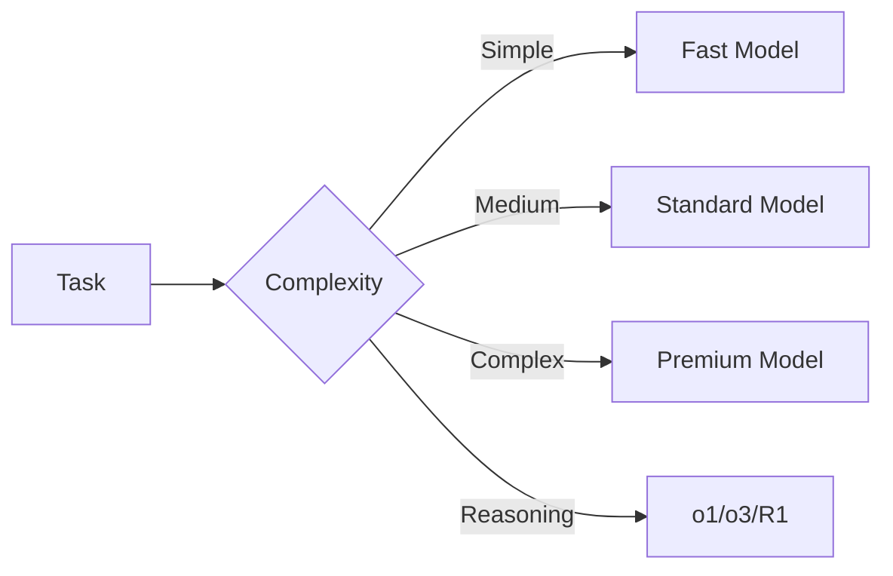

Configuration commands manage system settings, API keys, and LLM model selection in AgentOS.

## Config Commands

### config show

Display the current configuration.

```bash
agentos config show
```

**Example output:**
```toml
default_model = "claude-opus-4-6"
api_url = "http://localhost:3111"

[keys]
anthropic = "sk-ant-..."
openai = "sk-..."
```

### config get

Get the value of a specific configuration key.

```bash
agentos config get <key>
```

<ParamField path="key" type="string" required>
  Configuration key to retrieve
</ParamField>

**Example:**
```bash
agentos config get default_model
```

**Output:**
```
default_model = claude-opus-4-6
```

### config set

Set a configuration value.

```bash
agentos config set <key> <value>
```

<ParamField path="key" type="string" required>
  Configuration key to set
</ParamField>

<ParamField path="value" type="string" required>
  Value to set
</ParamField>

**Example:**
```bash
agentos config set default_model gemini-2.0-flash
```

**Output:**
```
✓ Set default_model = gemini-2.0-flash
```

### config unset

Remove a configuration key.

```bash
agentos config unset <key>
```

<ParamField path="key" type="string" required>
  Configuration key to remove
</ParamField>

**Example:**
```bash
agentos config unset custom_setting
```

**Output:**
```
✓ Removed key: custom_setting
```

### config set-key

Set an API key for an LLM provider.

```bash
agentos config set-key <provider> <key>
```

<ParamField path="provider" type="string" required>
  Provider name (e.g., anthropic, openai, google)
</ParamField>

<ParamField path="key" type="string" required>
  API key value
</ParamField>

**Example:**
```bash
agentos config set-key anthropic $ANTHROPIC_API_KEY
agentos config set-key openai sk-proj-...
agentos config set-key google $GOOGLE_API_KEY
```

**Output:**
```
✓ API key set for anthropic
```

<Info>
  API keys are stored in `~/.agentos/config.toml` under the `[keys]` section.
</Info>

### config keys

List all configured API keys (masked for security).

```bash
agentos config keys
```

**Example output:**
```
PROVIDER             STATUS
anthropic            sk-a...xyz
openai              sk-p...abc
google              AIza...def
groq                gsk-...ghi
```

## Models Commands

Manage and explore available LLM models.

### models list

List all available models with pricing and capabilities.

```bash
agentos models list
```

**Example output:**
```
MODEL                     PROVIDER        TIER         CONTEXT    PRICE (in/out)
claude-opus-4-6           anthropic       premium      200K       $15/$75
claude-sonnet-4-6         anthropic       standard     200K       $3/$15
claude-haiku-3-5          anthropic       fast         200K       $0.80/$4
gpt-4o                    openai          premium      128K       $2.50/$10
gpt-4o-mini               openai          fast         128K       $0.15/$0.60
o1                        openai          reasoning    200K       $15/$60
o3-mini                   openai          reasoning    200K       $1.10/$4.40
gemini-2.0-flash          google          fast         1000K      $0.075/$0.30
gemini-2.0-pro            google          standard     2000K      $1.25/$5
deepseek-v3               deepseek        standard     64K        $0.27/$1.10
deepseek-r1               deepseek        reasoning    64K        $0.55/$2.19
llama-3.3-70b             groq            standard     128K       $0.59/$0.79
mistral-large             mistral         premium      128K       $2/$6
command-r-plus            cohere          standard     128K       $2.50/$10
```

**Columns explained:**
- **TIER**: `fast` (quick/cheap), `standard` (balanced), `premium` (best quality), `reasoning` (o1/o3 style)
- **CONTEXT**: Context window size in tokens (K = 1,000)
- **PRICE**: Cost per million tokens (input/output) in USD

### models aliases

List model aliases and their mappings.

```bash
agentos models aliases
```

**Example output:**
```
  opus → claude-opus-4-6
  sonnet → claude-sonnet-4-6
  haiku → claude-haiku-3-5
  gpt4 → gpt-4o
  gpt4-mini → gpt-4o-mini
  gemini → gemini-2.0-flash
  fast → gemini-2.0-flash
  premium → claude-opus-4-6
  reasoning → o1
```

Use aliases in configuration:
```bash
agentos config set default_model opus
```

### models providers

List all LLM providers and their status.

```bash
agentos models providers
```

**Example output:**
```
  ● Anthropic          (3 models)
  ● OpenAI            (4 models)
  ● Google            (2 models)
  ● DeepSeek          (2 models)
  ● Groq              (5 models)
  ● Mistral           (3 models)
  ● Cohere            (2 models)
  ○ AWS Bedrock       (0 models)
  ○ Azure OpenAI      (0 models)
```

- ● Green dot = Provider configured with API key
- ○ Red dot = Provider not configured

### models describe

Get detailed information about a specific model.

```bash
agentos models describe <model>
```

<ParamField path="model" type="string" required>
  Model ID or alias
</ParamField>

**Example:**
```bash
agentos models describe claude-opus-4-6
```

**Output:**
```json
{
  "id": "claude-opus-4-6",
  "provider": "anthropic",
  "name": "Claude Opus 4.6",
  "tier": "premium",
  "contextWindow": 200000,
  "maxOutputTokens": 16384,
  "inputPrice": 15.0,
  "outputPrice": 75.0,
  "capabilities": [
    "chat",
    "function-calling",
    "vision",
    "streaming"
  ],
  "strengths": [
    "Complex reasoning",
    "Code generation",
    "Long context understanding",
    "Multilingual"
  ],
  "released": "2026-02-15"
}
```

## Supported LLM Providers

AgentOS supports 25 LLM providers:

<Tabs>
  <Tab title="Major Providers">
    - **Anthropic** - Claude Opus, Sonnet, Haiku
    - **OpenAI** - GPT-4o, GPT-4o-mini, o1, o3-mini
    - **Google** - Gemini 2.0 Flash, Pro
    - **AWS Bedrock** - Claude, Titan
    - **Azure OpenAI** - GPT models on Azure
  </Tab>
  <Tab title="Fast Inference">
    - **Groq** - Ultra-fast inference (Llama, Mixtral)
    - **Fireworks** - Fast open-source models
    - **Cerebras** - Ultra-fast inference
    - **Together** - Fast model serving
  </Tab>
  <Tab title="Open Source">
    - **Ollama** - Run models locally
    - **vLLM** - Self-hosted deployment
    - **LM Studio** - Local model runtime
    - **Replicate** - Cloud open-source models
    - **HuggingFace** - Inference API
  </Tab>
  <Tab title="Specialized">
    - **DeepSeek** - V3 and R1 (reasoning)
    - **Mistral** - Large, Medium, Small
    - **Cohere** - Command R+
    - **Perplexity** - Sonar models
    - **xAI** - Grok
    - **AI21** - Jamba
    - **SambaNova** - Enterprise models
    - **Qwen** - Alibaba models
    - **Minimax** - Chinese models
    - **Zhipu** - GLM models
    - **Moonshot** - Kimi models
  </Tab>
  <Tab title="Routing">
    - **OpenRouter** - Multi-provider routing
  </Tab>
</Tabs>

## Model Selection

AgentOS uses complexity-based model selection:



**Complexity scoring factors:**
- Input token count
- Task type (code, reasoning, chat)
- Context requirements
- Budget constraints

Override with explicit model selection:
```bash
agentos config set default_model claude-opus-4-6
```

## Configuration File Structure

Location: `~/.agentos/config.toml`

```toml
# Global settings
default_model = "claude-opus-4-6"
api_url = "http://localhost:3111"
log_level = "info"

# API keys
[keys]
anthropic = "sk-ant-..."
openai = "sk-proj-..."
google = "AIza..."
groq = "gsk-..."

# Model preferences
[models]
prefer_fast = ["gemini-2.0-flash", "gpt-4o-mini"]
prefer_reasoning = ["o1", "deepseek-r1"]
prefer_premium = ["claude-opus-4-6", "gpt-4o"]

# Budget limits
[budget]
max_tokens_per_day = 1000000
max_cost_per_day = 100.0

# Security
[security]
audit_enabled = true
approval_tier = "async"
```

## Environment Variables

You can also configure via environment variables:

```bash
# API keys
export ANTHROPIC_API_KEY="sk-ant-..."
export OPENAI_API_KEY="sk-proj-..."
export GOOGLE_API_KEY="AIza..."

# Settings
export AGENTOS_API_URL="http://localhost:3111"
export AGENTOS_DEFAULT_MODEL="claude-opus-4-6"
export AGENTOS_LOG_LEVEL="debug"
```

Priority order:
1. Command-line arguments
2. Environment variables
3. Config file (`~/.agentos/config.toml`)
4. Defaults

## Examples

<CodeGroup>
```bash Initial Setup
# Initialize AgentOS
agentos init --quick

# Set API keys
agentos config set-key anthropic $ANTHROPIC_API_KEY
agentos config set-key openai $OPENAI_API_KEY

# Set default model
agentos config set default_model opus

# Verify configuration
agentos config show
```

```bash Model Management
# List all models
agentos models list

# Check providers
agentos models providers

# Get model details
agentos models describe deepseek-r1

# Use alias
agentos config set default_model reasoning
```

```bash Multi-Provider
# Configure multiple providers
agentos config set-key anthropic $ANTHROPIC_API_KEY
agentos config set-key openai $OPENAI_API_KEY
agentos config set-key google $GOOGLE_API_KEY
agentos config set-key groq $GROQ_API_KEY

# List configured keys
agentos config keys
```

```bash Budget Control
# Set budget limits
agentos config set max_tokens_per_day 1000000
agentos config set max_cost_per_day 50.0

# Verify settings
agentos config get max_cost_per_day
```
</CodeGroup>

## Model Comparison

| Use Case | Recommended Model | Why |
|----------|------------------|-----|
| Quick chat | gemini-2.0-flash, gpt-4o-mini | Fast, cheap, good quality |
| Code generation | claude-sonnet-4-6, gpt-4o | Best code understanding |
| Complex reasoning | claude-opus-4-6, o1 | Superior reasoning ability |
| Long context | gemini-2.0-pro | 2M token context window |
| Budget-conscious | haiku, gpt-4o-mini | Lowest cost per token |
| Math/logic | o1, deepseek-r1 | Specialized reasoning |
| Local/offline | ollama (llama-3.3-70b) | No API needed |
| Ultra-fast | groq (llama-3.3-70b) | Fastest inference |

## Best Practices

<AccordionGroup>
  <Accordion title="Secure API keys">
    Never commit API keys to version control. Use environment variables or the config file (which should be gitignored).
  </Accordion>
  
  <Accordion title="Use aliases">
    Use model aliases like `opus` or `fast` instead of full model names for easier switching.
  </Accordion>
  
  <Accordion title="Set budget limits">
    Configure daily token and cost limits to prevent unexpected charges.
  </Accordion>
  
  <Accordion title="Multiple providers">
    Configure multiple providers for fallback and cost optimization.
  </Accordion>
  
  <Accordion title="Model-specific agents">
    Create agents with specific models for specialized tasks (e.g., reasoning agent with o1).
  </Accordion>
</AccordionGroup>

## Next Steps

<CardGroup cols={2}>
  <Card title="Agent Commands" icon="robot" href="/cli/agent-commands">
    Create agents with specific models
  </Card>
  <Card title="Security" icon="shield" href="/cli/security-commands">
    Configure security and budget limits
  </Card>
  <Card title="Workflows" icon="diagram-project" href="/cli/workflow-commands">
    Use different models in workflows
  </Card>
  <Card title="CLI Overview" icon="terminal" href="/cli/overview">
    Back to CLI overview
  </Card>
</CardGroup>
