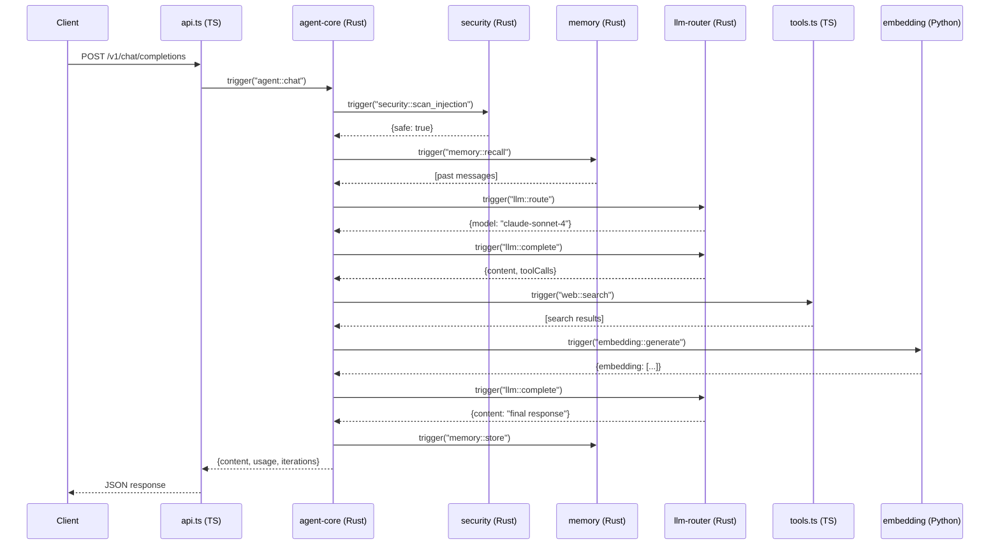

AgentOS is built on a **polyglot architecture** where components written in Rust, TypeScript, and Python communicate through the iii-engine bus. Every component is a worker that registers functions - no frameworks, no vendor lock-in.

## Architecture Overview

```
┌──────────────────────────────────────────────────────────────┐
│                        iii-engine                            │
│              Worker · Function · Trigger                     │
├──────────┬───────────┬───────────┬───────────┬───────────────┤
│ agent    │ security  │    llm    │  memory   │     wasm      │
│ core     │  rbac     │  router   │  store    │    sandbox    │
│ workflow │  audit    │ 25 LLMs   │  session  │   (wasmtime)  │
│ api      │  taint    │  catalog  │  recall   │    (Rust)     │
│ hand     │  sign     │   (Rust)  │  (Rust)   │               │
│ (Rust)   │  (Rust)   │           │           │               │
├──────────┴───────────┴───────────┴───────────┴───────────────┤
│                   Control Plane (Rust)                       │
│  realm · hierarchy · directive · mission · ledger            │
│  council · pulse · bridge (8 crates, 45 functions)           │
├──────────────────────────────────────────────────────────────┤
│  api · workflows · tools(60+) · skills · channels · hooks    │
│  approval · streaming · mcp · a2a · vault · browser · swarm  │
│  knowledge-graph · session-replay · skillkit · tool-profiles │
│                      (TypeScript)                            │
├──────────────────────────────────────────────────────────────┤
│                    embedding (Python)                        │
├──────────────────────────────────────────────────────────────┤
│     CLI (Rust)              TUI (Rust/ratatui)               │
└──────────────────────────────────────────────────────────────┘
```

## Design Principles

<CardGroup cols={2}>
  <Card title="Polyglot by Design" icon="language">
    Use the right language for each task - Rust for performance, TypeScript for iteration speed, Python for ML.
  </Card>
  <Card title="No Frameworks" icon="ban">
    Every capability is a plain function. No magic, no vendor lock-in.
  </Card>
  <Card title="Trigger-Based Communication" icon="bolt">
    Components call each other via `trigger()`. Language doesn't matter.
  </Card>
  <Card title="Hot-Swappable" icon="arrows-rotate">
    Replace any component without touching others. Just register new functions.
  </Card>
</CardGroup>

## The iii-engine Bus

At the center is the **iii-engine** - a WebSocket-based message bus that:

1. **Accepts connections** from workers (any language)
2. **Stores function registry** (all registered functions)
3. **Routes invocations** to the correct worker
4. **Manages modules** (state, queue, pubsub, cron, HTTP API)

<Note>
Every component connects to the iii-engine over WebSocket at `ws://localhost:49134`.
</Note>

### iii-engine Modules

The engine provides core services via modules:

```yaml
# From config.yaml:1-68
port: 49134

modules:
  # HTTP REST API (port 3111)
  - class: modules::api::RestApiModule
    config:
      port: 3111
      host: 0.0.0.0
      concurrency_request_limit: 2048

  # State storage (file-based KV store)
  - class: modules::state::StateModule
    config:
      adapter:
        class: modules::state::adapters::KvStore
        config:
          store_method: file_based
          file_path: ./data/state

  # WebSocket streams (port 3112)
  - class: modules::stream::StreamModule
    config:
      port: 3112

  # Task queue
  - class: modules::queue::QueueModule
    config:
      adapter:
        class: modules::queue::BuiltinQueueAdapter

  # Pub/Sub messaging
  - class: modules::pubsub::PubSubModule
    config:
      adapter:
        class: modules::pubsub::LocalAdapter

  # Cron scheduler
  - class: modules::cron::CronModule
    config:
      adapter:
        class: modules::cron::KvCronAdapter

  # Key-value store
  - class: modules::kv_server::KvServer
    config:
      store_method: file_based
      file_path: ./data/kv
      save_interval_ms: 5000

  # Observability (OpenTelemetry)
  - class: modules::observability::OtelModule
    config:
      enabled: true
      exporter: memory
      metrics_enabled: true
```

## Architecture Layers

### Layer 1: Hot Path (Rust)

Performance-critical operations run in Rust:

| Crate | LOC | Purpose | Key Functions |
|-------|-----|---------|---------------|
| `agent-core` | 320 | ReAct agent loop | `agent::chat`, `agent::create`, `agent::list_tools` |
| `memory` | 840 | Session/episodic memory | `memory::store`, `memory::recall`, `memory::consolidate` |
| `llm-router` | 320 | 25 LLM providers | `llm::route`, `llm::complete` |
| `security` | 700 | RBAC, audit, taint | `security::check_capability`, `security::scan_injection` |
| `wasm-sandbox` | 180 | WASM execution | `wasm::execute` |

**Why Rust?** Low latency, high throughput, memory safety. The hot path handles every agent invocation.

### Layer 2: Control Plane (Rust)

Multi-tenant orchestration layer:

| Crate | LOC | Purpose | Endpoints |
|-------|-----|---------|----------|
| `realm` | 280 | Multi-tenant isolation | 7 REST |
| `hierarchy` | 250 | Agent org structure | 5 REST |
| `directive` | 280 | Goal alignment | 5 REST |
| `mission` | 350 | Task lifecycle | 7 REST |
| `ledger` | 300 | Budget enforcement | 4 REST + 1 PubSub |
| `council` | 450 | Governance | 6 REST + 1 PubSub |
| `pulse` | 250 | Scheduled invocation | 4 REST |
| `bridge` | 300 | External runtimes | 5 REST |

**Why Rust?** Reliability, strong typing, predictable performance for orchestration.

### Layer 3: Application (TypeScript)

Rapid iteration and integrations:

| Worker | Purpose | Key Functions |
|--------|---------|---------------|
| `api.ts` | OpenAI-compatible API | `api::chat_completions` |
| `agent-core.ts` | TS agent loop | `agent::chat` |
| `tools.ts` | 22 built-in tools | `file::read`, `web::search`, `shell::exec` |
| `tools-extended.ts` | 38 extended tools | `schedule::*`, `media::*`, `data::*` |
| `swarm.ts` | Multi-agent swarms | `swarm::create`, `swarm::coordinate` |
| `knowledge-graph.ts` | Entity-relation graph | `kg::add`, `kg::query`, `kg::visualize` |
| `session-replay.ts` | Session recording | `replay::record`, `replay::get`, `replay::summary` |
| `vault.ts` | Encrypted secrets | `vault::set`, `vault::get`, `vault::list` |
| `browser.ts` | Headless browser | `browser::navigate`, `browser::screenshot` |
| `channels/*.ts` | 40 channel adapters | Slack, Discord, Telegram, WhatsApp, etc. |

**Why TypeScript?** Fast iteration, rich ecosystem, excellent tooling.

### Layer 4: ML (Python)

Machine learning workloads:

```python
# From workers/embedding/main.py
iii = III("ws://localhost:49134", worker_name="embedding")

@iii.function(id="embedding::generate", description="Generate text embeddings")
async def generate_embedding(input):
    text = input.get("text", "")
    model = SentenceTransformer("all-MiniLM-L6-v2")
    embedding = model.encode([text], normalize_embeddings=True)[0]
    return {"embedding": embedding.tolist(), "dim": len(embedding)}
```

**Why Python?** Best ML ecosystem (transformers, sentence-transformers, numpy).

## Communication Flow

All components communicate via `trigger()`, regardless of language:



## Real Code Example: Cross-Language Calls

Here's actual code showing Rust calling TypeScript calling Python:

<CodeGroup>
```rust Rust Agent Calls TypeScript Tool
// From crates/agent-core/src/main.rs:199-213
// Rust agent calls TypeScript tool
for tc in &calls {
    // tc.id might be "web::search" (TypeScript)
    // or "embedding::generate" (Python)
    match iii.trigger(&tc.id, tc.arguments.clone()).await {
        Ok(result) => {
            tool_results.push(json!({
                "toolCallId": tc.call_id,
                "output": result,
            }));
        }
        Err(e) => {
            tool_results.push(json!({
                "toolCallId": tc.call_id,
                "output": { "error": e.to_string() },
            }));
        }
    }
}
```

```typescript TypeScript Tool Calls Python Embedding
// TypeScript worker calls Python embedding
const embedding = await trigger("embedding::generate", {
  text: "query text for similarity search"
});

// Returns: { embedding: [0.1, 0.2, ...], dim: 384 }
```

```python Python Embedding Returns to TypeScript
# From workers/embedding/main.py:26-46
@iii.function(
    id="embedding::generate",
    description="Generate text embeddings"
)
async def generate_embedding(input):
    text = input.get("text", "")
    model = get_model()
    
    embedding = model.encode([text], normalize_embeddings=True)[0]
    return {"embedding": embedding.tolist(), "dim": len(embedding)}
```
</CodeGroup>

## Complete Request Flow

Here's what happens when a user sends a chat message:

<Steps>
  <Step title="HTTP Request">
    Client sends `POST /v1/chat/completions` to port 3111
    
    ```json
    {"model": "gpt-4", "messages": [{"role": "user", "content": "Hello"}]}
    ```
  </Step>

  <Step title="API Worker (TypeScript)">
    `api.ts` receives HTTP trigger, validates request, calls `agent::chat`
    
    ```typescript
    const response = await trigger("agent::chat", {
      agentId: "default",
      message: "Hello"
    });
    ```
  </Step>

  <Step title="Agent Core (Rust)">
    `agent-core` orchestrates the request:
    
    ```rust
    // Security scan
    let scan = iii.trigger("security::scan_injection", json!({"text": msg})).await?;
    
    // Recall memories
    let memories = iii.trigger("memory::recall", json!({"agentId": id})).await?;
    
    // Route to model
    let model = iii.trigger("llm::route", json!({"message": msg})).await?;
    
    // Call LLM
    let response = iii.trigger("llm::complete", json!({model, messages})).await?;
    ```
  </Step>

  <Step title="Tool Execution (TypeScript/Python)">
    If LLM requests tools, agent calls them:
    
    ```rust
    for tool_call in response.tool_calls {
        let result = iii.trigger(&tool_call.id, tool_call.args).await?;
    }
    ```
    
    Tools might be TypeScript (`web::search`) or Python (`embedding::generate`).
  </Step>

  <Step title="Memory Storage (Rust)">
    Store conversation in memory:
    
    ```rust
    iii.trigger_void("memory::store", json!({
        "agentId": id,
        "role": "assistant",
        "content": response.content
    }));
    ```
  </Step>

  <Step title="HTTP Response">
    `api.ts` returns OpenAI-compatible response:
    
    ```json
    {
      "choices": [{"message": {"role": "assistant", "content": "Hi there!"}}],
      "usage": {"prompt_tokens": 10, "completion_tokens": 5}
    }
    ```
  </Step>
</Steps>

## Scalability

### Horizontal Scaling

<CardGroup cols={2}>
  <Card title="Multiple Workers" icon="layer-group">
    Run multiple instances of the same worker for load balancing
  </Card>
  <Card title="Language Independence" icon="language">
    Scale TypeScript workers separately from Rust workers
  </Card>
  <Card title="Queue-Based" icon="list">
    Use queue triggers for task distribution across workers
  </Card>
  <Card title="Stateless Workers" icon="database">
    All state in iii-engine modules, workers are ephemeral
  </Card>
</CardGroup>

### Starting Workers

<Tabs>
  <Tab title="Production">
    ```bash
    # CLI manages all workers
    agentos start
    ```
  </Tab>

  <Tab title="Development">
    ```bash
    # Start iii-engine
    iii --config config.yaml

    # Start Rust workers
    cargo run --release -p agentos-core &
    cargo run --release -p agentos-security &
    cargo run --release -p agentos-memory &
    cargo run --release -p agentos-llm-router &

    # Start TypeScript workers
    npx tsx src/api.ts &
    npx tsx src/agent-core.ts &
    npx tsx src/tools.ts &

    # Start Python workers
    python workers/embedding/main.py &
    ```
  </Tab>
</Tabs>

## Project Structure

```
agentos/
├── config.yaml              # iii-engine configuration
├── Cargo.toml               # Rust workspace
├── package.json             # Node.js dependencies
│
├── crates/                  # Rust workers (18 crates)
│   ├── agent-core/          # ReAct agent loop (Rust)
│   ├── security/            # RBAC, audit, taint (Rust)
│   ├── memory/              # Session memory (Rust)
│   ├── llm-router/          # 25 LLM providers (Rust)
│   ├── wasm-sandbox/        # WASM execution (Rust)
│   ├── realm/               # Multi-tenant isolation
│   ├── mission/             # Task lifecycle
│   └── ...                  # 11 more Rust crates
│
├── src/                     # TypeScript workers (39 files)
│   ├── api.ts               # OpenAI API (TypeScript)
│   ├── agent-core.ts        # Agent loop (TypeScript)
│   ├── tools.ts             # 22 built-in tools
│   ├── tools-extended.ts    # 38 extended tools
│   ├── swarm.ts             # Multi-agent swarms
│   ├── knowledge-graph.ts   # Entity-relation graph
│   ├── session-replay.ts    # Session recording
│   ├── channels/            # 40 channel adapters
│   └── ...                  # 30+ more TypeScript workers
│
├── workers/                 # Python workers
│   └── embedding/
│       └── main.py          # Text embeddings (Python)
│
├── agents/                  # 45 agent templates
├── hands/                   # 7 autonomous hands
└── integrations/            # 25 MCP integrations
```

## Technology Stack

### Languages & Frameworks

| Layer | Language | Runtime | Key Libraries |
|-------|----------|---------|---------------|
| Hot Path | Rust | Native | tokio, serde, iii-sdk |
| Control Plane | Rust | Native | tokio, serde, iii-sdk |
| Application | TypeScript | Node.js 20+ | iii-sdk, tsx |
| ML | Python | 3.11+ | iii-sdk, sentence-transformers |

### iii-engine

| Component | Technology |
|-----------|------------|
| Message Bus | WebSocket (port 49134) |
| HTTP API | REST (port 3111) |
| Streams | WebSocket (port 3112) |
| State | File-based KV store |
| Queue | Built-in adapter |
| PubSub | Local adapter |
| Cron | KV-based scheduler |

## Testing

AgentOS has **2,506 tests** across all languages:

```bash
# TypeScript tests (1,439 tests)
npx vitest --run

# Rust tests (906 tests)
cargo test --workspace

# Python tests (161 tests)
python3 -m pytest
```

### Test Coverage by Layer

| Layer | Tests | Files |
|-------|-------|-------|
| TypeScript | 1,439 | 48 |
| Rust | 906 | 10 crates |
| Python | 161 | 3 |

## Observability

All workers report metrics to the observability module:

```yaml
# From config.yaml:54-68
modules:
  - class: modules::observability::OtelModule
    config:
      enabled: true
      exporter: memory
      metrics_enabled: true
      logs_enabled: true
      alerts:
        - name: high-error-rate
          metric: iii.invocations.error
          threshold: 10
          operator: ">"
          window_seconds: 60
          action:
            type: log
```

### Key Metrics

- `iii.invocations.total` - Total function invocations
- `iii.invocations.error` - Failed invocations
- `function_call_duration_ms` - Latency histogram
- `tokens_used_total` - LLM token usage
- `active_sessions` - Concurrent chat sessions

## Benefits of This Architecture

<CardGroup cols={2}>
  <Card title="Language Flexibility" icon="language">
    Use Rust for hot path, TypeScript for APIs, Python for ML - all seamlessly integrated
  </Card>
  <Card title="No Vendor Lock-in" icon="unlock">
    Every function is plain code. Switch components without rewriting the system.
  </Card>
  <Card title="Hot-Swappable" icon="arrows-rotate">
    Replace any worker at runtime. Register new functions without downtime.
  </Card>
  <Card title="Testable" icon="vial">
    Every function can be tested independently. 2,506 tests prove it works.
  </Card>
  <Card title="Scalable" icon="chart-line">
    Scale individual workers based on load. Add more workers dynamically.
  </Card>
  <Card title="Observable" icon="chart-mixed">
    OpenTelemetry metrics, alerts, and logs for full system visibility.
  </Card>
</CardGroup>

## Next Steps

<CardGroup cols={3}>
  <Card title="Workers" icon="microchip" href="/concepts/worker">
    Learn how to create workers in Rust, TypeScript, and Python
  </Card>
  <Card title="Functions" icon="function" href="/concepts/function">
    Deep dive into function registration and invocation
  </Card>
  <Card title="Triggers" icon="bolt" href="/concepts/trigger">
    Explore HTTP, queue, cron, and pubsub triggers
  </Card>
</CardGroup>
