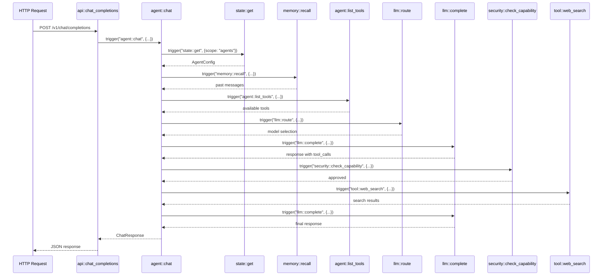

A **Function** is a callable unit of work with a unique ID, description, and handler. Functions are registered by workers and can be invoked by other functions via `trigger()` - even across different programming languages.

## What is a Function?

A function in AgentOS consists of:

1. **Unique ID**: Namespaced identifier (e.g., `agent::chat`, `memory::store`)
2. **Description**: Human-readable explanation of what the function does
3. **Handler**: Async callback that processes input and returns output
4. **Optional Metadata**: Category, tags, or other annotations

<Note>
Functions are **language-agnostic**. A Rust function can call a TypeScript function, which can call a Python function, all via `trigger()`.
</Note>

## Registering Functions

<Tabs>
  <Tab title="Rust">
    ### Rust Function Registration

    Use `register_function_with_description()` to register functions:

    ```rust
    // From crates/agent-core/src/main.rs:18-30
    let iii = III::new("ws://localhost:49134");

    let iii_clone = iii.clone();
    iii.register_function_with_description(
        "agent::chat",
        "Process a message through the agent loop",
        move |input: Value| {
            let iii = iii_clone.clone();
            async move {
                let req: ChatRequest = serde_json::from_value(input)
                    .map_err(|e| IIIError::Handler(e.to_string()))?;
                agent_chat(&iii, req).await
            }
        },
    );
    ```

    ### Multiple Functions

    ```rust
    // From crates/agent-core/src/main.rs:32-70
    iii.register_function_with_description(
        "agent::list_tools",
        "List tools available to an agent",
        move |input: Value| {
            let iii = iii_clone.clone();
            async move {
                let agent_id = input["agentId"].as_str().unwrap_or("default");
                list_tools(&iii, agent_id).await
            }
        },
    );

    iii.register_function_with_description(
        "agent::create",
        "Register a new agent",
        move |input: Value| {
            let iii = iii_clone.clone();
            async move {
                let config: AgentConfig = serde_json::from_value(input)
                    .map_err(|e| IIIError::Handler(e.to_string()))?;
                create_agent(&iii, config).await
            }
        },
    );

    iii.register_function_with_description(
        "agent::list",
        "List all agents",
        move |_: Value| {
            let iii = iii_clone.clone();
            async move {
                iii.trigger("state::list", json!({ "scope": "agents" })).await
                    .map_err(|e| IIIError::Handler(e.to_string()))
            }
        },
    );
    ```
  </Tab>

  <Tab title="TypeScript">
    ### TypeScript Function Registration

    Use `registerFunction()` from the `init()` result:

    ```typescript
    // From src/agent-core.ts:710-831
    const { registerFunction, trigger } = init(ENGINE_URL, {
      workerName: "agent-core"
    });

    registerFunction(
      {
        id: "agent::chat",
        description: "Process a message through the agent loop",
        metadata: { category: "agent" },
      },
      async (input: ChatRequest): Promise<ChatResponse> => {
        // Handler implementation
        const config: AgentConfig = await trigger("state::get", {
          scope: "agents",
          key: input.agentId,
        });

        const memories = await trigger("memory::recall", {
          agentId: input.agentId,
          query: input.message,
          limit: 20,
        });

        return {
          content: "response",
          model: "claude-sonnet-4",
          usage: { input: 100, output: 50 },
          iterations: 0,
        };
      },
    );
    ```

    ### Multiple Functions

    ```typescript
    // From src/agent-core.ts:833-907
    registerFunction(
      {
        id: "agent::list_tools",
        description: "List tools available to an agent",
        metadata: { category: "agent" },
      },
      async ({ agentId }: { agentId: string }) => {
        const config = await trigger("state::get", {
          scope: "agents",
          key: agentId,
        });

        const allFunctions = await listFunctions();
        return allFunctions;
      },
    );

    registerFunction(
      {
        id: "agent::create",
        description: "Register a new agent",
        metadata: { category: "agent" },
      },
      async (config: AgentConfig) => {
        const agentId = config.id || crypto.randomUUID();
        await trigger("state::set", {
          scope: "agents",
          key: agentId,
          value: { ...config, id: agentId, createdAt: Date.now() },
        });
        return { agentId };
      },
    );

    registerFunction(
      {
        id: "agent::list",
        description: "List all agents",
        metadata: { category: "agent" },
      },
      async () => {
        return trigger("state::list", { scope: "agents" });
      },
    );
    ```
  </Tab>

  <Tab title="Python">
    ### Python Function Registration

    Use the `@iii.function()` decorator:

    ```python
    # From workers/embedding/main.py:26-46
    from iii_sdk import III

    iii = III("ws://localhost:49134", worker_name="embedding")

    @iii.function(
        id="embedding::generate",
        description="Generate text embeddings"
    )
    async def generate_embedding(input):
        text = input.get("text", "")
        batch = input.get("batch")

        model = get_model()

        if batch:
            embeddings = model.encode(batch, normalize_embeddings=True)
            return {
                "embeddings": [e.tolist() for e in embeddings],
                "dim": embeddings.shape[1],
            }

        embedding = model.encode([text], normalize_embeddings=True)[0]
        return {"embedding": embedding.tolist(), "dim": len(embedding)}
    ```

    ### Multiple Functions

    ```python
    # From workers/embedding/main.py:49-62
    @iii.function(
        id="embedding::similarity",
        description="Compute cosine similarity"
    )
    async def compute_similarity(input):
        a = input.get("a", [])
        b = input.get("b", [])

        if len(a) != len(b) or not a:
            return {"similarity": 0.0}

        dot = sum(x * y for x, y in zip(a, b))
        norm_a = sum(x * x for x in a) ** 0.5
        norm_b = sum(x * x for x in b) ** 0.5
        denom = norm_a * norm_b

        return {"similarity": dot / denom if denom > 0 else 0.0}
    ```
  </Tab>
</Tabs>

## Invoking Functions

Functions call other functions using `trigger()`. This works **across all languages**.

<CodeGroup>
```rust Rust trigger()
// From crates/agent-core/src/main.rs:115-122
let memories: Value = iii
    .trigger("memory::recall", json!({
        "agentId": &req.agent_id,
        "query": &req.message,
        "limit": 20,
    }))
    .await
    .unwrap_or(json!([]));

let tools: Value = iii
    .trigger("agent::list_tools", json!({ "agentId": &req.agent_id }))
    .await
    .unwrap_or(json!([]));

let model: Value = iii
    .trigger("llm::route", json!({
        "message": &req.message,
        "toolCount": tools.as_array().map(|a| a.len()).unwrap_or(0),
    }))
    .await
    .map_err(|e| IIIError::Handler(e.to_string()))?;
```

```typescript TypeScript trigger()
// From src/agent-core.ts:101-126
const config: AgentConfig = await trigger("state::get", {
  scope: "agents",
  key: agentId,
});

const memories: any = await trigger("memory::recall", {
  agentId,
  query: message,
  limit: 20,
});

const tools: any = await trigger("agent::list_tools", { agentId });

const model = await trigger("llm::route", {
  message,
  toolCount: tools.length,
  config: config?.model,
});

const response = await trigger("llm::complete", {
  model,
  systemPrompt,
  messages,
  tools,
});
```

```python Python trigger()
# Python workers would use:
async def my_function(input):
    # Call other functions
    result = await iii.trigger("memory::store", {
        "agentId": input["agentId"],
        "content": input["content"],
    })
    return result
```
</CodeGroup>

## Function Call Flow

Here's a real example from the agent-core showing how functions chain together:



## Real Agent Loop Example

Here's the complete agent loop from the Rust agent-core, showing multiple function calls:

```rust
// From crates/agent-core/src/main.rs:103-265
async fn agent_chat(iii: &III, req: ChatRequest) -> Result<Value, IIIError> {
    let start = Instant::now();

    // 1. Get agent config
    let config: Option<AgentConfig> = iii
        .trigger("state::get", json!({
            "scope": "agents",
            "key": &req.agent_id,
        }))
        .await
        .ok()
        .and_then(|v| serde_json::from_value(v).ok());

    // 2. Recall memories
    let memories: Value = iii
        .trigger("memory::recall", json!({
            "agentId": &req.agent_id,
            "query": &req.message,
            "limit": 20,
        }))
        .await
        .unwrap_or(json!([]));

    // 3. Get available tools
    let tools: Value = iii
        .trigger("agent::list_tools", json!({ "agentId": &req.agent_id }))
        .await
        .unwrap_or(json!([]));

    // 4. Route to appropriate model
    let model: Value = iii
        .trigger("llm::route", json!({
            "message": &req.message,
            "toolCount": tools.as_array().map(|a| a.len()).unwrap_or(0),
        }))
        .await
        .map_err(|e| IIIError::Handler(e.to_string()))?;

    // 5. Security scan for injection
    let scan_result = iii
        .trigger("security::scan_injection", json!({ "text": &req.message }))
        .await
        .unwrap_or(json!({ "safe": true, "riskScore": 0.0 }));
    let risk_score = scan_result["riskScore"].as_f64().unwrap_or(0.0);
    if risk_score > 0.5 {
        return Err(IIIError::Handler(format!(
            "Message rejected: injection risk score {:.2} exceeds threshold",
            risk_score
        )));
    }

    // 6. Call LLM
    let mut response: Value = iii
        .trigger("llm::complete", json!({
            "model": model,
            "systemPrompt": system_prompt,
            "messages": messages,
            "tools": tools,
        }))
        .await
        .map_err(|e| IIIError::Handler(e.to_string()))?;

    // 7. Tool execution loop (up to 50 iterations)
    let mut iterations: u32 = 0;
    while let Some(tool_calls) = response.get("toolCalls").and_then(|v| v.as_array()) {
        if tool_calls.is_empty() || iterations >= MAX_ITERATIONS {
            break;
        }
        iterations += 1;

        for tc in &calls {
            // Check capability
            let cap_check = iii.trigger("security::check_capability", json!({
                "agentId": &req.agent_id,
                "capability": tc.id.split("::").next().unwrap_or(""),
                "resource": &tc.id,
            })).await;

            // Execute tool
            match iii.trigger(&tc.id, tc.arguments.clone()).await {
                Ok(result) => { /* use result */ }
                Err(e) => { /* handle error */ }
            }
        }

        // Get next response from LLM
        response = iii.trigger("llm::complete", json!({ /* ... */ })).await?;
    }

    // 8. Store in memory
    let _ = iii.trigger_void("memory::store", json!({
        "agentId": &req.agent_id,
        "sessionId": &session_id,
        "role": "user",
        "content": &req.message,
    }));

    Ok(json!({
        "content": response.get("content"),
        "model": response.get("model"),
        "usage": response.get("usage"),
        "iterations": iterations,
    }))
}
```

## Fire-and-Forget with triggerVoid

For operations you don't need to wait for (logging, metrics, etc.), use `triggerVoid`:

<CodeGroup>
```rust Rust triggerVoid
// From crates/agent-core/src/main.rs:85-88
let _ = iii.trigger_void("publish", json!({
    "topic": "agent.lifecycle",
    "data": { "type": "deleted", "agentId": agent_id },
}));
```

```typescript TypeScript triggerVoid
// From src/agent-core.ts:873-876
triggerVoid("publish", {
  topic: "agent.lifecycle",
  data: { type: "created", agentId },
});
```
</CodeGroup>

## Function Naming Conventions

All AgentOS functions follow the `namespace::action` pattern:

| Namespace | Purpose | Examples |
|-----------|---------|----------|
| `agent::` | Agent operations | `agent::chat`, `agent::create`, `agent::list` |
| `memory::` | Memory operations | `memory::store`, `memory::recall`, `memory::search` |
| `llm::` | LLM operations | `llm::route`, `llm::complete` |
| `security::` | Security checks | `security::check_capability`, `security::scan_injection` |
| `state::` | State management | `state::get`, `state::set`, `state::list`, `state::delete` |
| `tool::` | Tool execution | `tool::web_search`, `tool::file_read` |
| `file::` | File operations | `file::read`, `file::write`, `file::list` |
| `embedding::` | Embeddings | `embedding::generate`, `embedding::similarity` |

## Error Handling

<Tabs>
  <Tab title="Rust">
    ```rust
    // Return Result<Value, IIIError>
    async fn my_function(iii: &III, input: Value) -> Result<Value, IIIError> {
        let result = iii
            .trigger("other::function", input)
            .await
            .map_err(|e| IIIError::Handler(e.to_string()))?;
        
        Ok(json!({ "data": result }))
    }
    ```
  </Tab>

  <Tab title="TypeScript">
    ```typescript
    // Throw errors or return error objects
    registerFunction(
      { id: "my::function", description: "Example" },
      async (input) => {
        try {
          const result = await trigger("other::function", input);
          return { data: result };
        } catch (err) {
          // Option 1: Re-throw
          throw err;
          
          // Option 2: Return error object
          return { error: err.message };
        }
      },
    );
    ```
  </Tab>

  <Tab title="Python">
    ```python
    @iii.function(id="my::function", description="Example")
    async def my_function(input):
        try:
            result = await iii.trigger("other::function", input)
            return {"data": result}
        except Exception as e:
            # Option 1: Re-raise
            raise
            
            # Option 2: Return error object
            return {"error": str(e)}
    ```
  </Tab>
</Tabs>

## Best Practices

<CardGroup cols={2}>
  <Card title="Descriptive IDs" icon="tag">
    Use clear namespace::action format: `memory::store` not `mem_st`
  </Card>
  <Card title="Meaningful Descriptions" icon="message">
    Write descriptions that explain **why** and **when** to use the function
  </Card>
  <Card title="Type Safety" icon="shield">
    Parse and validate input, don't assume structure
  </Card>
  <Card title="Idempotency" icon="rotate">
    Design functions to be safely retried when possible
  </Card>
  <Card title="Fail Fast" icon="circle-xmark">
    Validate early, return errors quickly
  </Card>
  <Card title="Use triggerVoid" icon="paper-plane">
    Don't wait for logging, metrics, or non-critical operations
  </Card>
</CardGroup>

## Next Steps

<CardGroup cols={2}>
  <Card title="Triggers" icon="bolt" href="/concepts/trigger">
    Learn how to bind functions to HTTP, queue, and cron events
  </Card>
  <Card title="Architecture" icon="sitemap" href="/concepts/architecture">
    Understand how functions compose into the full system
  </Card>
</CardGroup>
