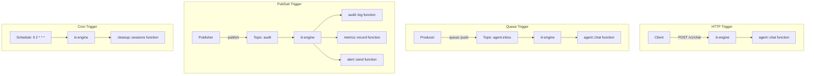

A **Trigger** binds a function to an event. When the event occurs (HTTP request, queue message, cron schedule, etc.), the iii-engine invokes the function automatically.

## What is a Trigger?

A trigger consists of:

1. **Type**: The event type (`http`, `queue`, `pubsub`, `cron`)
2. **Function ID**: The function to invoke when the event occurs
3. **Config**: Type-specific configuration (route, topic, schedule, etc.)

<Note>
Triggers are registered **after** functions. You can't trigger a function that doesn't exist.
</Note>

## Trigger Types

AgentOS supports four types of triggers:

<CardGroup cols={2}>
  <Card title="HTTP" icon="globe">
    Invoke function via HTTP request (REST API)
  </Card>
  <Card title="Queue" icon="list">
    Invoke function when message arrives in queue topic
  </Card>
  <Card title="PubSub" icon="tower-broadcast">
    Invoke function when message published to topic
  </Card>
  <Card title="Cron" icon="clock">
    Invoke function on schedule (cron expression)
  </Card>
</CardGroup>

## HTTP Triggers

HTTP triggers expose functions as REST API endpoints.

<Tabs>
  <Tab title="TypeScript">
    ```typescript
    // From src/agent-core.ts:924-928
    registerTrigger({
      type: "http",
      function_id: "api::chat_completions",
      config: {
        api_path: "v1/chat/completions",
        http_method: "POST"
      }
    });
    ```

    This creates an endpoint at `http://localhost:3111/v1/chat/completions` that invokes `api::chat_completions`.

    ### HTTP Configuration

    | Field | Type | Description |
    |-------|------|-------------|
    | `api_path` | string | URL path (without leading `/`) |
    | `http_method` | string | HTTP method: GET, POST, PUT, DELETE, OPTIONS |
  </Tab>

  <Tab title="Rust">
    ```rust
    // Rust uses the same config structure
    iii.register_trigger("http", "agent::get", json!({
        "api_path": "agents/:id",
        "http_method": "GET"
    }))?;
    ```
  </Tab>
</Tabs>

### HTTP Configuration from config.yaml

The REST API module is configured in `config.yaml`:

```yaml
# From config.yaml:4-13
modules:
  - class: modules::api::RestApiModule
    config:
      port: 3111
      host: 0.0.0.0
      default_timeout: 300000
      concurrency_request_limit: 2048
      cors:
        allowed_origins: ['*']
        allowed_methods: [GET, POST, PUT, DELETE, OPTIONS]
        allowed_headers: ['*']
```

<Note>
HTTP triggers are served on port `3111` (from config). The main WebSocket connection is on port `49134`.
</Note>

## Queue Triggers

Queue triggers invoke functions when messages arrive in a queue topic.

<Tabs>
  <Tab title="TypeScript">
    ```typescript
    // From src/agent-core.ts:924-928
    registerTrigger({
      type: "queue",
      function_id: "agent::chat",
      config: { topic: "agent.inbox" }
    });
    ```

    Now when a message is pushed to `agent.inbox`, the `agent::chat` function is invoked with the message data.
  </Tab>

  <Tab title="Rust">
    ```rust
    // From crates/agent-core/src/main.rs:95
    iii.register_trigger("queue", "agent::chat", json!({
        "topic": "agent.inbox"
    }))?;
    ```
  </Tab>
</Tabs>

### Queue Configuration

| Field | Type | Description |
|-------|------|-------------|
| `topic` | string | Queue topic name to subscribe to |

### Queue Module Configuration

```yaml
# From config.yaml:33-36
modules:
  - class: modules::queue::QueueModule
    config:
      adapter:
        class: modules::queue::BuiltinQueueAdapter
```

### Sending Messages to Queue

Push messages to the queue using `trigger("queue::push", ...)`:

```typescript
await trigger("queue::push", {
  topic: "agent.inbox",
  data: {
    agentId: "agent-123",
    message: "Hello!",
    sessionId: "sess-456"
  }
});
```

## PubSub Triggers

PubSub triggers invoke functions when messages are published to a topic.

<Tabs>
  <Tab title="TypeScript">
    ```typescript
    registerTrigger({
      type: "pubsub",
      function_id: "audit::log",
      config: { topic: "audit" }
    });
    ```
  </Tab>

  <Tab title="Rust">
    ```rust
    iii.register_trigger("pubsub", "audit::log", json!({
        "topic": "audit"
    }))?;
    ```
  </Tab>
</Tabs>

### PubSub vs Queue

| Feature | Queue | PubSub |
|---------|-------|--------|
| Delivery | One consumer receives each message | All subscribers receive each message |
| Ordering | FIFO (first in, first out) | No ordering guarantee |
| Use Case | Task distribution, load balancing | Events, notifications, logging |

### PubSub Module Configuration

```yaml
# From config.yaml:38-41
modules:
  - class: modules::pubsub::PubSubModule
    config:
      adapter:
        class: modules::pubsub::LocalAdapter
```

### Publishing Messages

Publish messages using `trigger("publish", ...)` or `triggerVoid("publish", ...)`:

```typescript
// From src/agent-core.ts:873-876
triggerVoid("publish", {
  topic: "agent.lifecycle",
  data: { type: "created", agentId }
});
```

Real example from Rust:

```rust
// From crates/agent-core/src/main.rs:85-88
let _ = iii.trigger_void("publish", json!({
    "topic": "agent.lifecycle",
    "data": { "type": "deleted", "agentId": agent_id },
}));
```

## Cron Triggers

Cron triggers invoke functions on a schedule.

```typescript
registerTrigger({
  type: "cron",
  function_id: "cleanup::old_sessions",
  config: {
    schedule: "0 2 * * *"  // Every day at 2 AM
  }
});
```

### Cron Configuration

| Field | Type | Description |
|-------|------|-------------|
| `schedule` | string | Cron expression (5-field format) |

### Cron Expression Format

```
┌───────────── minute (0 - 59)
│ ┌───────────── hour (0 - 23)
│ │ ┌───────────── day of month (1 - 31)
│ │ │ ┌───────────── month (1 - 12)
│ │ │ │ ┌───────────── day of week (0 - 6) (Sunday to Saturday)
│ │ │ │ │
│ │ │ │ │
* * * * *
```

### Common Cron Patterns

| Expression | Description |
|------------|-------------|
| `*/5 * * * *` | Every 5 minutes |
| `0 * * * *` | Every hour |
| `0 0 * * *` | Every day at midnight |
| `0 2 * * *` | Every day at 2 AM |
| `0 0 * * 0` | Every Sunday at midnight |
| `0 0 1 * *` | First day of every month |

### Cron Module Configuration

```yaml
# From config.yaml:43-46
modules:
  - class: modules::cron::CronModule
    config:
      adapter:
        class: modules::cron::KvCronAdapter
```

## Real-World Examples

### Agent Inbox Queue Trigger

The agent-core worker registers a queue trigger to process chat messages:

<CodeGroup>
```rust Rust Queue Trigger
// From crates/agent-core/src/main.rs:95
iii.register_trigger("queue", "agent::chat", json!({
    "topic": "agent.inbox"
}))?;
```

```typescript TypeScript Queue Trigger
// From src/agent-core.ts:924-928
registerTrigger({
  type: "queue",
  function_id: "agent::chat",
  config: { topic: "agent.inbox" }
});
```
</CodeGroup>

### Audit Event PubSub Trigger

Publishing audit events that multiple subscribers can consume:

```typescript
// From src/agent-core.ts:503-511
try {
  await triggerVoid("publish", {
    topic: "audit",
    data: {
      type: "tool_execution",
      agentId,
      tools: currentResponse.toolCalls.map((tc: ToolCall) => tc.id),
      iteration: iterations,
    },
  });
} catch (err: any) {
  console.warn("Audit publish failed", { agentId, error: err?.message });
}
```

### Lifecycle Events

Publishing agent lifecycle events:

<CodeGroup>
```typescript Created Event
// From src/agent-core.ts:873-876
triggerVoid("publish", {
  topic: "agent.lifecycle",
  data: { type: "created", agentId },
});
```

```rust Deleted Event
// From crates/agent-core/src/main.rs:85-88
let _ = iii.trigger_void("publish", json!({
    "topic": "agent.lifecycle",
    "data": { "type": "deleted", "agentId": agent_id },
}));
```
</CodeGroup>

## Trigger Registration Patterns

### Register All Triggers at Startup

```typescript
// Register functions first
registerFunction({ id: "agent::chat", description: "..." }, handler);
registerFunction({ id: "agent::create", description: "..." }, handler);

// Then register triggers
registerTrigger({ type: "queue", function_id: "agent::chat", config: { topic: "agent.inbox" } });
registerTrigger({ type: "http", function_id: "agent::create", config: { api_path: "agents", http_method: "POST" } });
```

### Multiple Triggers per Function

A single function can have multiple triggers:

```typescript
registerFunction({ id: "notify::send", description: "Send notification" }, handler);

// Trigger via HTTP
registerTrigger({ type: "http", function_id: "notify::send", config: { api_path: "notify", http_method: "POST" } });

// Trigger via queue
registerTrigger({ type: "queue", function_id: "notify::send", config: { topic: "notifications" } });

// Trigger via pubsub
registerTrigger({ type: "pubsub", function_id: "notify::send", config: { topic: "alerts" } });
```

## Managing Triggers at Runtime

Create triggers dynamically using the engine API:

```typescript
// Create cron trigger via API
await trigger("engine::triggers::create", {
  type: "cron",
  function_id: "cleanup::sessions",
  config: { schedule: "0 3 * * *" }
});

// List all triggers
const triggers = await trigger("engine::triggers::list", {});

// Delete trigger
await trigger("engine::triggers::delete", { triggerId: "trigger-123" });
```

## Best Practices

<CardGroup cols={2}>
  <Card title="Register After Functions" icon="arrow-down-1-9">
    Always register functions before their triggers. The engine can't trigger a function that doesn't exist.
  </Card>
  <Card title="Use Queue for Tasks" icon="list-check">
    Use queue triggers for task distribution and load balancing across workers.
  </Card>
  <Card title="Use PubSub for Events" icon="tower-broadcast">
    Use pubsub triggers for events that multiple subscribers need to process.
  </Card>
  <Card title="Descriptive Topics" icon="tag">
    Use namespaced topic names: `agent.lifecycle`, `audit.security`, `task.completed`
  </Card>
  <Card title="Handle Failures" icon="shield">
    Queue and pubsub handlers should handle errors gracefully - failed messages may be retried.
  </Card>
  <Card title="Idempotent Handlers" icon="rotate">
    Design handlers to be safely retried. Don't assume messages are delivered exactly once.
  </Card>
</CardGroup>

## Trigger Flow Diagram



## Complete Example: Agent System

Here's how triggers work together in the agent system:

```typescript
// 1. Register chat function
registerFunction(
  { id: "agent::chat", description: "Process chat message" },
  async (input) => {
    // Process message
    const response = await trigger("llm::complete", { ... });
    
    // Publish lifecycle event
    triggerVoid("publish", {
      topic: "agent.lifecycle",
      data: { type: "message_processed", agentId: input.agentId }
    });
    
    return response;
  }
);

// 2. Register HTTP trigger for direct API calls
registerTrigger({
  type: "http",
  function_id: "agent::chat",
  config: { api_path: "v1/chat/completions", http_method: "POST" }
});

// 3. Register queue trigger for async processing
registerTrigger({
  type: "queue",
  function_id: "agent::chat",
  config: { topic: "agent.inbox" }
});

// 4. Register audit logger for lifecycle events
registerFunction(
  { id: "audit::log", description: "Log audit events" },
  async (event) => {
    await trigger("state::append", {
      scope: "audit",
      key: "lifecycle",
      value: event
    });
  }
);

registerTrigger({
  type: "pubsub",
  function_id: "audit::log",
  config: { topic: "agent.lifecycle" }
});

// 5. Register cleanup cron
registerFunction(
  { id: "cleanup::sessions", description: "Clean old sessions" },
  async () => {
    const cutoff = Date.now() - 7 * 24 * 60 * 60 * 1000; // 7 days
    await trigger("memory::cleanup", { before: cutoff });
  }
);

registerTrigger({
  type: "cron",
  function_id: "cleanup::sessions",
  config: { schedule: "0 3 * * *" } // 3 AM daily
});
```

## Next Steps

<CardGroup cols={2}>
  <Card title="Architecture" icon="sitemap" href="/concepts/architecture">
    See how all components work together in the system architecture
  </Card>
  <Card title="Workers" icon="microchip" href="/concepts/worker">
    Learn more about creating and managing workers
  </Card>
</CardGroup>
