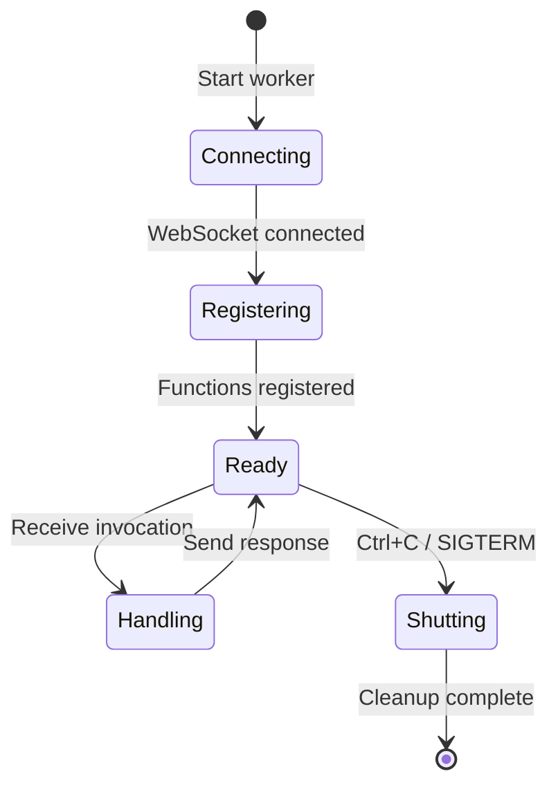

A **Worker** is a process that connects to the iii-engine over WebSocket and registers functions. Workers can be written in Rust, TypeScript, or Python.

## What is a Worker?

A worker is simply a program that:

1. Connects to the iii-engine via WebSocket (default: `ws://localhost:49134`)
2. Registers one or more functions with unique IDs
3. Stays running to handle function invocations
4. Optionally registers triggers to bind functions to events

<Note>
Workers are stateless. They don't store data - they connect, register functions, and handle invocations. All state is managed by the iii-engine modules (state, queue, pubsub, etc.).
</Note>

## Creating Workers in Different Languages

<Tabs>
  <Tab title="Rust">
    ### Rust Worker

    Rust workers use the `iii-sdk` crate and are ideal for performance-critical operations.

    ```rust
    // From crates/agent-core/src/main.rs:13-101
    use iii_sdk::iii::III;
    use iii_sdk::error::IIIError;
    use serde_json::{json, Value};

    #[tokio::main]
    async fn main() -> Result<(), Box<dyn std::error::Error>> {
        tracing_subscriber::fmt::init();

        // 1. Connect to iii-engine
        let iii = III::new("ws://localhost:49134");

        // 2. Register function with description
        let iii_clone = iii.clone();
        iii.register_function_with_description(
            "agent::chat",
            "Process a message through the agent loop",
            move |input: Value| {
                let iii = iii_clone.clone();
                async move {
                    let req: ChatRequest = serde_json::from_value(input)
                        .map_err(|e| IIIError::Handler(e.to_string()))?;
                    agent_chat(&iii, req).await
                }
            },
        );

        // 3. Register more functions
        iii.register_function_with_description(
            "agent::list_tools",
            "List tools available to an agent",
            move |input: Value| {
                let iii = iii_clone.clone();
                async move {
                    let agent_id = input["agentId"].as_str().unwrap_or("default");
                    list_tools(&iii, agent_id).await
                }
            },
        );

        // 4. Register trigger to bind function to queue
        iii.register_trigger("queue", "agent::chat", json!({
            "topic": "agent.inbox"
        }))?;

        // 5. Keep running
        tracing::info!("agent-core worker started");
        tokio::signal::ctrl_c().await?;
        iii.shutdown_async().await;
        Ok(())
    }
    ```

    ### Key Rust Patterns

    <Steps>
      <Step title="Clone for async handlers">
        Clone the `iii` instance for each async handler to satisfy Rust's ownership rules:
        ```rust
        let iii_clone = iii.clone();
        iii.register_function_with_description(
            "my::function",
            "Description",
            move |input| {
                let iii = iii_clone.clone();
                async move { /* use iii here */ }
            },
        );
        ```
      </Step>

      <Step title="Parse input with serde">
        Use `serde_json` to deserialize input:
        ```rust
        let req: ChatRequest = serde_json::from_value(input)
            .map_err(|e| IIIError::Handler(e.to_string()))?;
        ```
      </Step>

      <Step title="Keep the process alive">
        Workers must stay running to handle invocations:
        ```rust
        tokio::signal::ctrl_c().await?;
        iii.shutdown_async().await;
        ```
      </Step>
    </Steps>
  </Tab>

  <Tab title="TypeScript">
    ### TypeScript Worker

    TypeScript workers use the `iii-sdk` npm package and are ideal for rapid iteration.

    ```typescript
    // From src/agent-core.ts:1-24
    import { init } from "iii-sdk";
    import { ENGINE_URL } from "./shared/config.js";

    // 1. Initialize connection and get helpers
    const {
      registerFunction,
      registerTrigger,
      trigger,
      triggerVoid,
      listFunctions,
    } = init(ENGINE_URL, { workerName: "agent-core" });

    // 2. Register functions
    registerFunction(
      {
        id: "agent::chat",
        description: "Process a message through the agent loop",
        metadata: { category: "agent" },
      },
      async (input: ChatRequest): Promise<ChatResponse> => {
        // Handler implementation
        const config = await trigger("state::get", {
          scope: "agents",
          key: input.agentId,
        });

        return { content: "response", iterations: 0 };
      },
    );

    // 3. Register trigger
    registerTrigger({
      type: "queue",
      function_id: "agent::chat",
      config: { topic: "agent.inbox" },
    });
    ```

    ### TypeScript Patterns

    <Steps>
      <Step title="Initialize once">
        Call `init()` once at the top of your worker file:
        ```typescript
        const { registerFunction, trigger, triggerVoid } = init(
          "ws://localhost:49134",
          { workerName: "my-worker" }
        );
        ```
      </Step>

      <Step title="Use async/await">
        All function handlers should be async:
        ```typescript
        registerFunction(
          { id: "my::function", description: "Does something" },
          async (input) => {
            const result = await trigger("other::function", { data: input });
            return result;
          },
        );
        ```
      </Step>

      <Step title="Fire-and-forget with triggerVoid">
        Use `triggerVoid` for operations you don't need to wait for:
        ```typescript
        triggerVoid("publish", {
          topic: "agent.lifecycle",
          data: { type: "created", agentId },
        });
        ```
      </Step>
    </Steps>
  </Tab>

  <Tab title="Python">
    ### Python Worker

    Python workers use the `iii-sdk` package and are ideal for ML workloads.

    ```python
    # From workers/embedding/main.py:1-91
    import asyncio
    import os
    from iii_sdk import III

    # 1. Create III instance with worker name
    iii = III(
        "ws://localhost:49134",
        worker_name="embedding",
    )

    # 2. Register function using decorator
    @iii.function(
        id="embedding::generate",
        description="Generate text embeddings"
    )
    async def generate_embedding(input):
        text = input.get("text", "")
        batch = input.get("batch")

        model = get_model()

        if batch:
            embeddings = model.encode(batch, normalize_embeddings=True)
            return {
                "embeddings": [e.tolist() for e in embeddings],
                "dim": embeddings.shape[1],
            }

        embedding = model.encode([text], normalize_embeddings=True)[0]
        return {"embedding": embedding.tolist(), "dim": len(embedding)}

    @iii.function(
        id="embedding::similarity",
        description="Compute cosine similarity"
    )
    async def compute_similarity(input):
        a = input.get("a", [])
        b = input.get("b", [])

        if len(a) != len(b) or not a:
            return {"similarity": 0.0}

        dot = sum(x * y for x, y in zip(a, b))
        norm_a = sum(x * x for x in a) ** 0.5
        norm_b = sum(x * x for x in b) ** 0.5
        denom = norm_a * norm_b

        return {"similarity": dot / denom if denom > 0 else 0.0}

    # 3. Keep worker running
    async def main():
        print("embedding worker started")
        try:
            await asyncio.Event().wait()
        except KeyboardInterrupt:
            await iii.shutdown()

    if __name__ == "__main__":
        asyncio.run(main())
    ```

    ### Python Patterns

    <Steps>
      <Step title="Use decorator syntax">
        The `@iii.function()` decorator registers functions:
        ```python
        @iii.function(
            id="my::function",
            description="Does something"
        )
        async def my_function(input):
            return {"result": "data"}
        ```
      </Step>

      <Step title="All handlers are async">
        Function handlers must be async:
        ```python
        @iii.function(id="my::func", description="Example")
        async def my_func(input):
            result = await iii.trigger("other::func", {"data": input})
            return result
        ```
      </Step>

      <Step title="Use asyncio.Event for blocking">
        Keep the worker alive with an event:
        ```python
        async def main():
            print("worker started")
            await asyncio.Event().wait()  # Blocks forever
        ```
      </Step>
    </Steps>
  </Tab>
</Tabs>

## Worker Lifecycle



<Steps>
  <Step title="Connecting">
    Worker connects to iii-engine WebSocket
  </Step>
  <Step title="Registering">
    Worker registers all functions and triggers
  </Step>
  <Step title="Ready">
    Worker waits for function invocations
  </Step>
  <Step title="Handling">
    Worker executes function handler and returns result
  </Step>
  <Step title="Shutting">
    Worker gracefully shuts down on signal
  </Step>
</Steps>

## Worker Configuration

Workers connect to the iii-engine, which is configured via `config.yaml`:

```yaml
# From config.yaml:1-14
port: 49134

modules:
  - class: modules::api::RestApiModule
    config:
      port: 3111
      host: 0.0.0.0
      default_timeout: 300000
      concurrency_request_limit: 2048
      cors:
        allowed_origins: ['*']
        allowed_methods: [GET, POST, PUT, DELETE, OPTIONS]
        allowed_headers: ['*']
```

### Connection URL

Workers connect to `ws://localhost:{port}` where `port` is from `config.yaml` (default: `49134`).

## Real AgentOS Workers

Here are the actual workers running in AgentOS:

### Rust Workers (18 crates)

| Worker | LOC | Purpose | Key Functions |
|--------|-----|---------|---------------|
| `agent-core` | 320 | ReAct agent loop | `agent::chat`, `agent::create`, `agent::list` |
| `security` | 700 | RBAC, audit, taint tracking | `security::check_capability`, `security::scan_injection` |
| `memory` | 840 | Session/episodic memory | `memory::store`, `memory::recall` |
| `llm-router` | 320 | 25 LLM providers | `llm::route`, `llm::complete` |
| `wasm-sandbox` | 180 | Untrusted code execution | `wasm::execute` |
| `realm` | 280 | Multi-tenant isolation | `realm::create`, `realm::get` |
| `mission` | 350 | Task lifecycle | `mission::create`, `mission::checkout` |

### TypeScript Workers (39 files)

| Worker | Purpose | Key Functions |
|--------|---------|---------------|
| `api.ts` | OpenAI-compatible API | `api::chat_completions` |
| `agent-core.ts` | TS agent loop | `agent::chat` (TypeScript version) |
| `tools.ts` | Built-in tools (22) | `file::read`, `web::search`, `shell::exec` |
| `swarm.ts` | Multi-agent swarms | `swarm::create`, `swarm::coordinate` |
| `knowledge-graph.ts` | Entity-relation graph | `kg::add`, `kg::query` |
| `session-replay.ts` | Session recording | `replay::record`, `replay::get` |

### Python Workers (1)

| Worker | Purpose | Key Functions |
|--------|---------|---------------|
| `embedding/main.py` | Text embeddings | `embedding::generate`, `embedding::similarity` |

## Starting Workers

<Tabs>
  <Tab title="Production (CLI)">
    ```bash
    # Start all workers automatically
    agentos start
    ```
  </Tab>

  <Tab title="Development (Manual)">
    ```bash
    # Start Rust workers
    cargo run --release -p agentos-core &
    cargo run --release -p agentos-security &
    cargo run --release -p agentos-memory &

    # Start TypeScript workers
    npx tsx src/api.ts &
    npx tsx src/agent-core.ts &
    npx tsx src/tools.ts &

    # Start Python workers
    python workers/embedding/main.py &
    ```
  </Tab>
</Tabs>

## Best Practices

<CardGroup cols={2}>
  <Card title="One Worker, Multiple Functions" icon="layer-group">
    Group related functions in a single worker (e.g., all memory functions in `memory` worker)
  </Card>
  <Card title="Use Descriptive Names" icon="tag">
    Function IDs should follow `namespace::action` pattern (e.g., `agent::chat`, `memory::store`)
  </Card>
  <Card title="Handle Errors Gracefully" icon="shield-halved">
    Return error objects instead of throwing exceptions when possible
  </Card>
  <Card title="Keep Workers Stateless" icon="database">
    Store state in iii-engine modules (state, kv, etc.), not in worker memory
  </Card>
</CardGroup>

## Next Steps

<CardGroup cols={2}>
  <Card title="Functions" icon="function" href="/concepts/function">
    Learn how to register and invoke functions
  </Card>
  <Card title="Triggers" icon="bolt" href="/concepts/trigger">
    Explore how to bind functions to events
  </Card>
</CardGroup>
