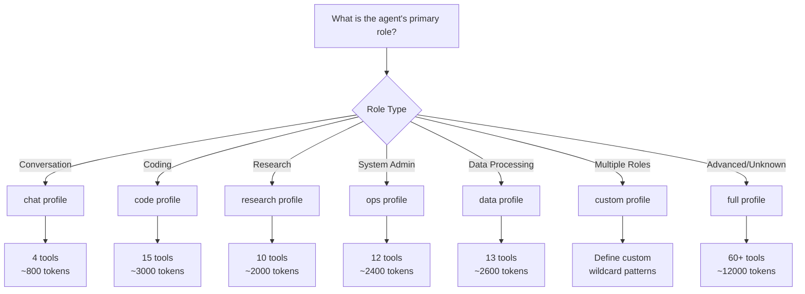

Tool profiles allow AgentOS to reduce prompt overhead by filtering the available tools based on each agent's role. Instead of sending 60+ tool definitions to every agent, profiles provide only the relevant subset.

## Why Tool Profiles?

**Problem:** Sending all 60+ tools to every agent wastes tokens and can degrade LLM performance.

**Solution:** Profiles define wildcard patterns that match tool IDs, enabling flexible filtering:

- **`chat` profile** — 4 tools (web search, fetch, memory)
- **`code` profile** — ~15 tools (file operations, shell, code analysis)
- **`full` profile** — All 60+ tools (for advanced agents)

**Token Savings:**

| Profile | Tools | Estimated Tokens | Savings |
|---------|-------|-----------------|--------|
| Full | 60+ | ~12,000 | 0% (baseline) |
| Chat | 4 | ~800 | 93% |
| Code | 15 | ~3,000 | 75% |
| Research | 10 | ~2,000 | 83% |
| Ops | 12 | ~2,400 | 80% |
| Data | 13 | ~2,600 | 78% |

## Available Profiles

### chat

**Use Case:** General conversation, web research, memory recall.

**Tools:**
- `tool::web_search` — Multi-provider web search
- `tool::web_fetch` — HTTP fetching with SSRF protection
- `memory::recall` — Retrieve stored memories
- `memory::store` — Save memories for later

**Example Agent:**

```yaml
# agents/assistant.yaml
name: assistant
profile: chat
instructions: |
  You are a helpful assistant that can search the web and remember
  information across conversations.
```

**Token Overhead:** ~800 tokens (4 tools × ~200 tokens each)

---

### code

**Use Case:** Software development, debugging, code review.

**Tools:**
- `tool::file_*` — All file operations (read, write, list, patch)
- `tool::shell_exec` — Execute shell commands
- `tool::code_*` — All code tools (analyze, format, lint, test, explain)
- `tool::apply_patch` — Apply unified diffs

**Example Agent:**

```yaml
# agents/coder.yaml
name: coder
profile: code
instructions: |
  You are a software engineer. You can read/write files, run commands,
  analyze code, format, lint, and run tests.
```

**Token Overhead:** ~3,000 tokens (~15 tools)

**Matched Tools:**
```
tool::file_read
tool::file_write
tool::file_list
tool::apply_patch
tool::shell_exec
tool::code_analyze
tool::code_format
tool::code_lint
tool::code_test
tool::code_explain
```

---

### research

**Use Case:** Deep web research, information gathering, fact-checking.

**Tools:**
- `tool::web_*` — All web tools (search, fetch, screenshot, browser)
- `tool::browser_*` — Browser automation actions
- `memory::*` — All memory tools (store, recall, search)

**Example Agent:**

```yaml
# agents/researcher.yaml
name: researcher
profile: research
instructions: |
  You are a research assistant. Use web search, fetch pages, take
  screenshots, and remember findings across research sessions.
```

**Token Overhead:** ~2,000 tokens (~10 tools)

---

### ops

**Use Case:** System administration, monitoring, DevOps.

**Tools:**
- `tool::shell_exec` — Execute system commands
- `tool::system_*` — System information (system_info)
- `tool::process_*` — Process monitoring (process_list)
- `tool::disk_*` — Disk usage (disk_usage)
- `tool::network_*` — Network checks (network_check)

**Example Agent:**

```yaml
# agents/sysadmin.yaml
name: sysadmin
profile: ops
instructions: |
  You are a system administrator. Monitor processes, check disk usage,
  verify network connectivity, and execute maintenance commands.
```

**Token Overhead:** ~2,400 tokens (~12 tools)

---

### data

**Use Case:** Data processing, ETL, file transformation.

**Tools:**
- `tool::json_*` — JSON tools (parse, stringify, query, transform)
- `tool::csv_*` — CSV tools (parse, stringify)
- `tool::yaml_*` — YAML tools (parse, stringify)
- `tool::regex_*` — Regex tools (test, match, replace)
- `tool::file_*` — File operations for reading/writing data

**Example Agent:**

```yaml
# agents/data-processor.yaml
name: data-processor
profile: data
instructions: |
  You are a data processing specialist. Parse, transform, and convert
  data between JSON, CSV, and YAML formats.
```

**Token Overhead:** ~2,600 tokens (~13 tools)

---

### full

**Use Case:** Advanced agents that need access to all capabilities.

**Tools:**
- `tool::*` — All 60+ tools
- `memory::*` — All memory tools

**Example Agent:**

```yaml
# agents/advanced.yaml
name: advanced
profile: full
instructions: |
  You are an advanced agent with access to all system capabilities.
  Use appropriate tools for any task.
```

**Token Overhead:** ~12,000 tokens (60+ tools × ~200 tokens each)

<Warning>
Use the `full` profile sparingly. Most agents perform better with focused tool sets.
</Warning>

---

## Implementation

### Profile Definition

```typescript
// src/tool-profiles.ts
export const TOOL_PROFILES: Record<string, string[]> = {
  chat: [
    "tool::web_search",
    "tool::web_fetch",
    "memory::recall",
    "memory::store",
  ],
  code: [
    "tool::file_*",        // Wildcard: matches file_read, file_write, etc.
    "tool::shell_exec",
    "tool::code_*",        // Wildcard: matches code_analyze, code_format, etc.
    "tool::apply_patch",
  ],
  research: ["tool::web_*", "tool::browser_*", "memory::*"],
  ops: [
    "tool::shell_exec",
    "tool::system_*",
    "tool::process_*",
    "tool::disk_*",
    "tool::network_*",
  ],
  data: [
    "tool::json_*",
    "tool::csv_*",
    "tool::yaml_*",
    "tool::regex_*",
    "tool::file_*",
  ],
  full: ["tool::*", "memory::*"],
};
```

### Pattern Matching

```typescript
// src/tool-profiles.ts:32-43
export function matchToolProfile(
  toolId: string,
  patterns: string[],
): boolean {
  return patterns.some((pattern) => {
    if (!pattern.includes("*")) return toolId === pattern;
    const regex = new RegExp(
      "^" + pattern.replace(/\*/g, ".*") + "$",
    );
    return regex.test(toolId);
  });
}
```

**Examples:**

```typescript
matchToolProfile("tool::file_read", ["tool::file_*"]);
// => true (wildcard match)

matchToolProfile("tool::web_search", ["tool::file_*"]);
// => false (no match)

matchToolProfile("memory::store", ["memory::*"]);
// => true (wildcard match)

matchToolProfile("tool::code_analyze", ["tool::code_*", "tool::web_*"]);
// => true (matches first pattern)
```

### Filtering Tools

```typescript
// src/tool-profiles.ts:45-55
export function filterToolsByProfile(
  tools: any[],
  profileName: string,
): any[] {
  const patterns = TOOL_PROFILES[profileName];
  if (!patterns) return tools;  // No profile = return all tools
  
  return tools.filter((t) => {
    const id = t.function_id || t.id || "";
    return matchToolProfile(id, patterns);
  });
}
```

**Usage in Agent Loop:**

```typescript
import { filterToolsByProfile } from "./tool-profiles.js";

// Get all registered tools
const allTools = await trigger("tools::list");

// Filter by agent profile
const agentProfile = agent.profile || "full";
const agentTools = filterToolsByProfile(allTools, agentProfile);

// Send filtered tools to LLM
const response = await llm.chat({
  messages: [...],
  tools: agentTools  // Only relevant tools
});
```

## Custom Profiles

Create custom profiles for specialized agents:

```typescript
// Add custom profile
TOOL_PROFILES.security = [
  "tool::code_analyze",
  "tool::code_explain",
  "tool::file_read",
  "tool::git_*",
  "security::*",
];

// Use in agent config
const securityAgent = {
  name: "security-auditor",
  profile: "security",
  instructions: "Review code for security vulnerabilities"
};
```

## Best Practices

<AccordionGroup>
  <Accordion title="Start with minimal profiles">
    Begin with the smallest profile that meets your agent's needs:
    
    ```yaml
    # Good: Focused profile
    profile: chat
    
    # Suboptimal: Overprovisioned profile
    profile: full
    ```
    
    You can always expand to `full` if the agent needs more capabilities.
  </Accordion>

  <Accordion title="Use wildcards for tool families">
    Group related tools with wildcard patterns:
    
    ```typescript
    // Good: Wildcard for all file operations
    ["tool::file_*"]
    
    // Verbose: Explicitly listing every tool
    ["tool::file_read", "tool::file_write", "tool::file_list", ...]
    ```
  </Accordion>

  <Accordion title="Combine profiles for hybrid agents">
    Create custom profiles by combining patterns:
    
    ```typescript
    TOOL_PROFILES.devops = [
      ...TOOL_PROFILES.code,   // Include all code tools
      ...TOOL_PROFILES.ops,    // Include all ops tools
      "tool::git_*",            // Add git tools
    ];
    ```
  </Accordion>

  <Accordion title="Monitor token usage">
    Track token overhead to validate profile effectiveness:
    
    ```typescript
    const tools = filterToolsByProfile(allTools, "chat");
    const tokenEstimate = tools.length * 200;  // ~200 tokens per tool
    console.log(`Profile 'chat' uses ~${tokenEstimate} tokens`);
    ```
  </Accordion>
</AccordionGroup>

## Profile Selection Guide



## Performance Impact

### Token Reduction

Profiles can reduce prompt size by 75-93%:

```typescript
// Without profiles (full)
const response = await llm.chat({
  messages,
  tools: allTools  // 60+ tools = 12,000 tokens
});
// Total prompt: ~15,000 tokens

// With profiles (chat)
const response = await llm.chat({
  messages,
  tools: filterToolsByProfile(allTools, "chat")  // 4 tools = 800 tokens
});
// Total prompt: ~3,800 tokens (75% reduction)
```

### Inference Speed

Smaller prompts = faster inference:

- **Full profile** — ~2.5s first token latency
- **Chat profile** — ~0.8s first token latency
- **Speedup** — 3.1x faster

### LLM Performance

Focused tool sets improve LLM tool selection:

- Fewer irrelevant tool calls
- Better tool usage accuracy
- Reduced hallucination of non-existent tools

## Related Documentation

- **[Tools Overview](/tools/overview)** — Complete tool catalog
- **[Agent Configuration](/agents/configuration)** — Set agent profiles
- **[Performance Optimization](/guides/performance)** — Token optimization strategies
